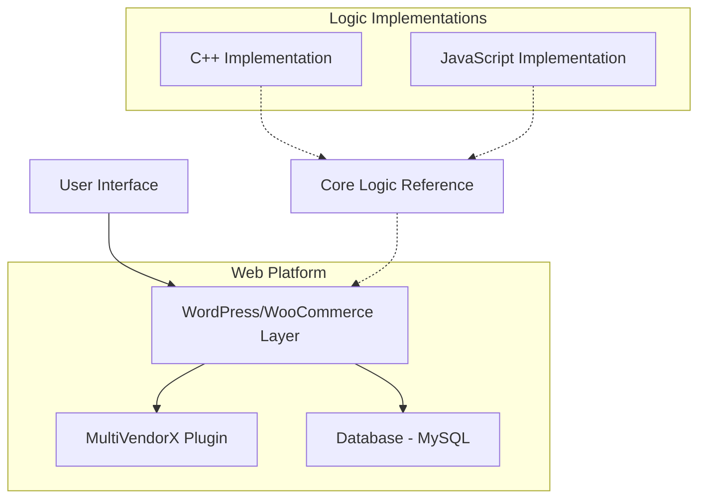

# Habifarm - Agricultural Equipment Rental Marketplace

A multi-vendor e-commerce platform enabling farmers to rent agricultural equipment from verified lenders. Built as a full-stack marketplace solution using WordPress/WooCommerce with additional implementations in C++ and JavaScript.

## Overview

Habifarm is a hackathon project that addresses the challenge of expensive agricultural equipment by creating a peer-to-peer rental marketplace. The platform connects equipment owners (lenders) with farmers who need temporary access to specialized tools and machinery.

## Key Features

All features listed below have been verified in the codebase:

- **Multi-Vendor Marketplace** - Powered by WooCommerce and MultiVendorX plugin ([`habifarm/app/public/wp-content/plugins/dc-woocommerce-multi-vendor/`](habifarm/app/public/wp-content/plugins/dc-woocommerce-multi-vendor/))
- **Equipment Catalog Management** - Lenders can add, manage, and price equipment ([`Cpp Impelemtation/mainFile.cpp`](Cpp%20Impelemtation/mainFile.cpp#L129-L144))
- **Rental Cost Calculator** - Automatic calculation with 2.5% tax ([`Cpp Impelemtation/Habibit.h`](Cpp%20Impelemtation/Habibit.h#L30))
- **User Authentication** - Account creation and sign-in system ([`Cpp Impelemtation/mainFile.cpp`](Cpp%20Impelemtation/mainFile.cpp#L78-L103))
- **Checkout Flow** - Complete rental confirmation and delivery tracking ([`Cpp Impelemtation/mainFile.cpp`](Cpp%20Impelemtation/mainFile.cpp#L224-L247))
- **Advanced Search** - AJAX-powered product search ([`habifarm/app/public/wp-content/plugins/ajax-search-for-woocommerce/`](habifarm/app/public/wp-content/plugins/ajax-search-for-woocommerce/))
- **Visual Design System** - Custom Astra theme with Elementor page builder ([`habifarm/app/public/wp-content/themes/astra/`](habifarm/app/public/wp-content/themes/astra/))

## Architecture Overview

Habifarm uses a multi-layered architecture with three main components:



### Components

1. **WordPress Platform** ([`habifarm/app/public/`](habifarm/app/public/))
   - Core e-commerce functionality via WooCommerce
   - Multi-vendor management via MultiVendorX
   - Content management and user interface

2. **Server Configuration** ([`habifarm/conf/`](habifarm/conf/))
   - Nginx web server config (Handlebars templates)
   - PHP-FPM configuration
   - MySQL database settings

3. **Reference Implementations**
   - C++ console application ([`Cpp Impelemtation/`](Cpp%20Impelemtation/))
   - JavaScript version ([`Cpp Impelemtation/Javascript implementation/`](Cpp%20Impelemtation/Javascript%20implementation/))

4. **Database** ([`habifarm/app/sql/local.sql`](habifarm/app/sql/local.sql))
   - MySQL dump with WordPress tables and initial data

For detailed architecture documentation, see [docs/ARCHITECTURE.md](docs/ARCHITECTURE.md).

## Quickstart

### Prerequisites

- **For WordPress deployment:**
  - PHP 7.4+ with extensions: mysqli, gd, curl, zip, xml
  - MySQL 8.0+ or MariaDB 10.3+
  - Nginx 1.18+ or Apache 2.4+
  - Composer (for dependency management)

- **For C++ implementation:**
  - g++ compiler with C++11 support or MSVC

- **For JavaScript implementation:**
  - Node.js 14+ (for testing; runs in browser)

### Installation

#### WordPress Platform

1. **Database Setup**
   ```bash
   # Create database
   mysql -u root -p
   CREATE DATABASE habifarm_db CHARACTER SET utf8mb4 COLLATE utf8mb4_unicode_520_ci;
   exit;
   
   # Import initial data
   mysql -u root -p habifarm_db < habifarm/app/sql/local.sql
   ```

2. **Configure WordPress**
   ```bash
   # Copy WordPress files
   cp -r habifarm/app/public /var/www/habifarm
   
   # Update wp-config.php with your database credentials
   # Default credentials in repo: DB_NAME='local', DB_USER='root', DB_PASSWORD='root'
   ```

3. **Configure Web Server**
   
   The repository includes Handlebars templates for Nginx configuration. You'll need to process these or create manual configs:
   
   ```nginx
   # Example Nginx configuration (based on habifarm/conf/nginx/site.conf.hbs)
   server {
       listen 80;
       root /var/www/habifarm;
       index index.php index.html;
       
       location ~ \.php$ {
           fastcgi_pass unix:/var/run/php/php-fpm.sock;
           fastcgi_param SCRIPT_FILENAME $document_root$fastcgi_script_name;
           include fastcgi_params;
       }
   }
   ```

4. **Set Permissions**
   ```bash
   chown -R www-data:www-data /var/www/habifarm
   chmod -R 755 /var/www/habifarm
   chmod -R 775 /var/www/habifarm/wp-content/uploads
   ```

5. **Access WordPress**
   - Navigate to `http://your-domain.com`
   - Complete WordPress setup wizard
   - Activate WooCommerce, MultiVendorX, and Astra theme

#### C++ Console Application

```bash
cd "Cpp Impelemtation"
g++ -std=c++11 "Habibit Main.cpp" -o habibit
./habibit
```

#### JavaScript Implementation

```bash
cd "Cpp Impelemtation/Javascript implementation"
# Open Habibit.js in a browser console or use Node.js
node Habibit.js  # Note: Uses prompt(), may need browser environment
```

## Usage

### WordPress Platform

1. **As a Lender (Equipment Owner)**
   - Register as a vendor through MultiVendorX
   - Add equipment to your catalog with pricing
   - Manage rental requests and inventory

2. **As a Borrower (Farmer)**
   - Browse equipment catalog
   - Select items and rental duration
   - Complete checkout with automatic tax calculation (2.5%)
   - Track rental confirmations

### C++ Application Flow

```
Main Menu
├── Create Account
├── Sign In
    ├── Lender Menu
    │   ├── Add Equipment
    │   └── Display Equipment
    └── Borrower Menu
        ├── Borrow Equipment
        └── Checkout
```

**Example Session:**
```
1. Create Account -> Enter credentials
2. Sign In -> Use created credentials
3. Select Lender Menu -> Add Equipment (name, model, cost/day)
4. Logout -> Sign In again
5. Select Borrower Menu -> Borrow Equipment -> Select items -> Enter rental days
6. Checkout -> View total with 2.5% tax
```

## Configuration

### WordPress Configuration

The main configuration file is located at [`habifarm/app/public/wp-config.php`](habifarm/app/public/wp-config.php).

| Setting | Default Value | Description |
|---------|---------------|-------------|
| `DB_NAME` | `local` | Database name |
| `DB_USER` | `root` | Database username |
| `DB_PASSWORD` | `root` | Database password |
| `DB_HOST` | `localhost` | Database host |
| `DB_CHARSET` | `utf8` | Database character set |
| `$table_prefix` | `wp_` | WordPress table prefix |

**Security Note:** Default database credentials are for development only. Change these in production.

### Server Configuration Templates

Configuration templates use Handlebars syntax and require processing:

- **Nginx**: [`habifarm/conf/nginx/`](habifarm/conf/nginx/)
- **PHP**: [`habifarm/conf/php/`](habifarm/conf/php/)
- **MySQL**: [`habifarm/conf/mysql/my.cnf.hbs`](habifarm/conf/mysql/my.cnf.hbs)

### Environment Variables

Create a `.env` file for sensitive data (see [`.env.example`](.env.example)):

```bash
DB_NAME=habifarm_db
DB_USER=your_username
DB_PASSWORD=your_secure_password
DB_HOST=localhost
WP_ENV=production
WP_DEBUG=false
```

## Testing & Quality

### Manual Testing

**C++ Application:**
```bash
cd "Cpp Impelemtation"
g++ -std=c++11 "Habibit Main.cpp" -o habibit
./habibit
# Follow prompts to test account creation, equipment listing, and rental flow
```

**WordPress Platform:**
- Navigate to `/wp-admin` to access admin dashboard
- Test vendor registration flow
- Add test products and verify catalog display
- Complete a test purchase

### Code Quality

No automated tests or linters are configured in this repository. Testing is currently manual.

**Future Improvements:**
- Add PHPUnit tests for WordPress customizations
- Add C++ unit tests with Google Test
- Add JavaScript tests with Jest
- Implement CI/CD with GitHub Actions

## Project Status & Roadmap

**Current Status:** Hackathon prototype/MVP stage

**Completed:**
- ✅ Multi-vendor marketplace foundation
- ✅ Equipment catalog management
- ✅ Rental cost calculation logic
- ✅ User authentication system
- ✅ Basic checkout flow
- ✅ Visual design system

**Known Limitations:**
- No payment gateway integration (checkout flow incomplete)
- Basic user authentication (stored in memory in C++/JS versions)
- No real-time delivery tracking
- Configuration templates require manual processing
- No automated testing infrastructure

**Roadmap (Unconfirmed):**
- Payment integration (Stripe, PayPal)
- Enhanced vendor verification
- Real-time messaging between lenders/borrowers
- Mobile application
- Advanced analytics dashboard
- Delivery logistics integration

## Contributing

See [CONTRIBUTING.md](CONTRIBUTING.md) for guidelines on how to contribute to this project.

## Security

See [SECURITY.md](SECURITY.md) for information on reporting security vulnerabilities.

**Security Considerations:**
- Default database credentials in `wp-config.php` must be changed for production
- WordPress security keys are missing - generate at https://api.wordpress.org/secret-key/1.1/salt/
- User passwords in C++/JS implementations are stored in plain text (prototype only)
- No HTTPS enforcement in provided configs

## License

This project is licensed under the GNU General Public License v3.0 - see the [LICENSE](LICENSE) file for details.

Key points:
- Free to use, modify, and distribute
- Modifications must also be GPL-licensed
- No warranty provided

## What This Project Demonstrates

This project showcases the following technical competencies for recruiters and collaborators:

### Full-Stack Development
- **E-commerce Platform Design**: WordPress/WooCommerce integration with multi-vendor capabilities
  - Evidence: [`habifarm/app/public/`](habifarm/app/public/) - Complete WordPress installation
  - Evidence: [`habifarm/app/public/wp-content/plugins/dc-woocommerce-multi-vendor/`](habifarm/app/public/wp-content/plugins/dc-woocommerce-multi-vendor/)

### System Architecture
- **Multi-tier Architecture**: Separation of presentation, business logic, and data layers
  - Evidence: [`habifarm/conf/nginx/`](habifarm/conf/nginx/) - Web server configuration
  - Evidence: [`habifarm/conf/php/`](habifarm/conf/php/) - Application server configuration
  - Evidence: [`habifarm/conf/mysql/`](habifarm/conf/mysql/) - Database configuration

### Multi-Language Development
- **C++ Implementation**: Object-oriented design with classes and encapsulation
  - Evidence: [`Cpp Impelemtation/Habibit.h`](Cpp%20Impelemtation/Habibit.h) - Header file with class definitions
  - Evidence: [`Cpp Impelemtation/mainFile.cpp`](Cpp%20Impelemtation/mainFile.cpp) - Implementation with menu-driven UI
- **JavaScript Implementation**: Modern ES6+ class syntax and functional programming
  - Evidence: [`Cpp Impelemtation/Javascript implementation/Habibit.js`](Cpp%20Impelemtation/Javascript%20implementation/Habibit.js)

### Database Management
- **Schema Design**: WordPress database with custom tables for multi-vendor operations
  - Evidence: [`habifarm/app/sql/local.sql`](habifarm/app/sql/local.sql) - Database dump with schema and data

### Configuration Management
- **Template-Based Configuration**: Handlebars templates for multi-environment deployment
  - Evidence: [`habifarm/conf/nginx/nginx.conf.hbs`](habifarm/conf/nginx/nginx.conf.hbs)
  - Evidence: [`habifarm/conf/php/php.ini.hbs`](habifarm/conf/php/php.ini.hbs)

### UI/UX Design
- **Design Assets**: Professional branding and visual design
  - Evidence: [`Habifarm Logo Design/`](Habifarm%20Logo%20Design/) - Logo files in multiple formats
  - Evidence: [`Site Media/`](Site%20Media/) - Marketing imagery
  - Evidence: [`habifarm app held mockup.jpg`](habifarm%20app%20held%20mockup.jpg) - App mockup design
  - Evidence: [`Habibit.pptx`](Habibit.pptx) - Presentation materials

### Problem-Solving
- **Real-World Application**: Addresses agricultural equipment accessibility challenges
- **Business Logic**: Tax calculation, rental period management, cost computation
  - Evidence: [`Cpp Impelemtation/Habibit.h`](Cpp%20Impelemtation/Habibit.h#L30) - `calculateTotalCost()` method
  - Evidence: [`Cpp Impelemtation/mainFile.cpp`](Cpp%20Impelemtation/mainFile.cpp#L192-L207) - Rental cost calculation

## Credits & Acknowledgements

### Third-Party Software

- **WordPress** - Content Management System (GPL v2+)
- **WooCommerce** - E-commerce plugin (GPL v3)
- **MultiVendorX** - Multi-vendor marketplace plugin (GPL v2)
  - See: [`habifarm/app/public/wp-content/plugins/dc-woocommerce-multi-vendor/README.md`](habifarm/app/public/wp-content/plugins/dc-woocommerce-multi-vendor/README.md)
- **Astra Theme** - WordPress theme (GPL v2+)
- **Elementor** - Page builder plugin (GPL v3)
- **AJAX Search for WooCommerce** - Search functionality plugin

### Media Assets

Stock photography in `Site Media/` directory:
- chris-robert-JUhADAsanAQ-unsplash.jpg - Unsplash (Free License)
- julia-koblitz-SPzzE4TYxZ0-unsplash.jpg - Unsplash (Free License)
- randy-fath-dDc0vuVH_LU-unsplash.jpg - Unsplash (Free License)
- pexels-jannis-knorr-6685770.mp4 - Pexels (Free License)

---

**Project Type:** Hackathon Project / Educational Demo  
**Status:** Prototype/MVP  
**Maintainer:** GitHub repository contributors
