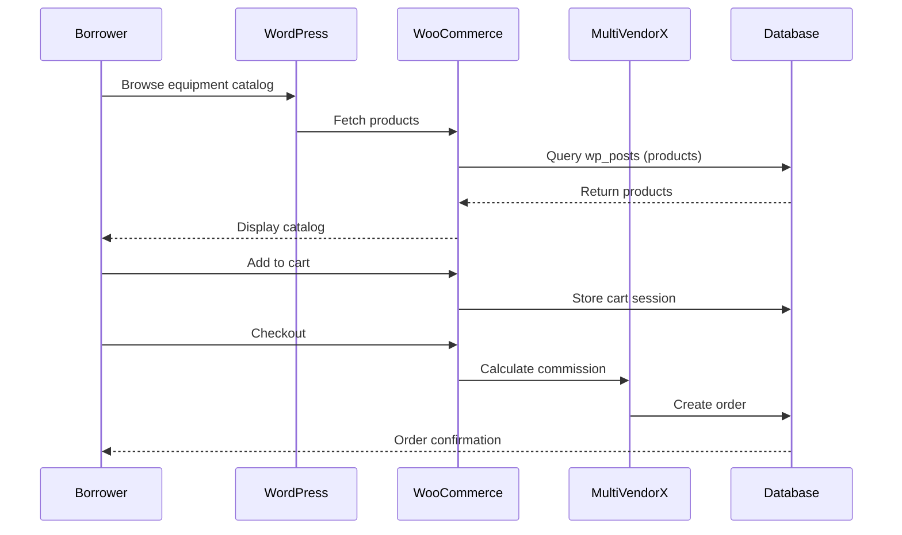
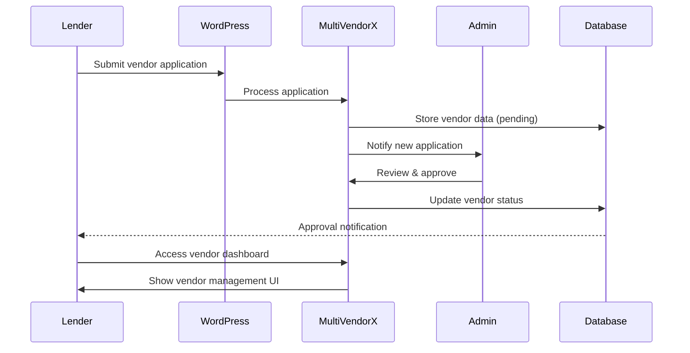

# Habifarm Architecture Documentation

## System Overview

Habifarm is a multi-vendor agricultural equipment rental marketplace built on WordPress/WooCommerce. The system architecture follows a traditional LAMP-like stack with additional multi-vendor capabilities provided by the MultiVendorX plugin.

## High-Level Architecture

```
┌─────────────────────────────────────────────────────────────┐
│                         End Users                            │
│              (Lenders & Borrowers/Farmers)                   │
└────────────────────────┬────────────────────────────────────┘
                         │
                         ▼
┌─────────────────────────────────────────────────────────────┐
│                    Nginx Web Server                          │
│                   (habifarm/conf/nginx/)                     │
└────────────────────────┬────────────────────────────────────┘
                         │
                         ▼
┌─────────────────────────────────────────────────────────────┐
│                   PHP-FPM Application                        │
│                   (habifarm/conf/php/)                       │
│                                                              │
│  ┌──────────────────────────────────────────────────────┐  │
│  │           WordPress Core                              │  │
│  │        (habifarm/app/public/)                        │  │
│  │                                                       │  │
│  │  ┌─────────────────────────────────────────────┐    │  │
│  │  │        WooCommerce Plugin                    │    │  │
│  │  │     (E-commerce functionality)              │    │  │
│  │  └─────────────────────────────────────────────┘    │  │
│  │                                                       │  │
│  │  ┌─────────────────────────────────────────────┐    │  │
│  │  │      MultiVendorX Plugin                     │    │  │
│  │  │   (Multi-vendor marketplace)                │    │  │
│  │  └─────────────────────────────────────────────┘    │  │
│  │                                                       │  │
│  │  ┌─────────────────────────────────────────────┐    │  │
│  │  │    Additional Plugins                        │    │  │
│  │  │  - AJAX Search for WooCommerce              │    │  │
│  │  │  - Elementor Page Builder                   │    │  │
│  │  └─────────────────────────────────────────────┘    │  │
│  │                                                       │  │
│  │  ┌─────────────────────────────────────────────┐    │  │
│  │  │       Astra Theme                            │    │  │
│  │  │    (UI/UX presentation layer)               │    │  │
│  │  └─────────────────────────────────────────────┘    │  │
│  └──────────────────────────────────────────────────────┘  │
└────────────────────────┬────────────────────────────────────┘
                         │
                         ▼
┌─────────────────────────────────────────────────────────────┐
│                   MySQL Database                             │
│                (habifarm/conf/mysql/)                        │
│                                                              │
│  - WordPress tables (wp_*)                                   │
│  - WooCommerce tables                                        │
│  - MultiVendorX vendor data                                  │
│  - Product catalog                                           │
│  - User accounts                                             │
└─────────────────────────────────────────────────────────────┘
```

## Component Details

### 1. Web Server Layer (Nginx)

**Location:** `habifarm/conf/nginx/`

**Purpose:** HTTP request handling, static file serving, PHP request proxying

**Key Files:**
- `nginx.conf.hbs` - Main Nginx configuration template
- `site.conf.hbs` - Site-specific configuration
- `includes/wordpress-single.conf.hbs` - WordPress-specific rules
- `includes/restrictions.conf.hbs` - Security restrictions
- `includes/gzip.conf.hbs` - Compression settings
- `includes/mime-types.conf.hbs` - MIME type definitions

**Configuration Highlights:**
```nginx
# From site.conf.hbs
- FastCGI pass to PHP-FPM
- WordPress permalink handling
- Static asset caching (CSS, JS, images)
- CORS headers for fonts
- PHP execution restrictions
```

### 2. Application Layer (PHP/WordPress)

**Location:** `habifarm/app/public/`

#### 2.1 WordPress Core

**Files:** Standard WordPress installation files
- `wp-config.php` - Database and security configuration
- `wp-admin/` - Admin dashboard
- `wp-includes/` - Core WordPress libraries
- `wp-content/` - Themes, plugins, uploads

#### 2.2 WooCommerce Plugin

**Purpose:** E-commerce functionality

**Features Used:**
- Product catalog management
- Shopping cart and checkout
- Order processing
- Payment gateway hooks (not integrated)

#### 2.3 MultiVendorX Plugin

**Location:** `habifarm/app/public/wp-content/plugins/dc-woocommerce-multi-vendor/`

**Purpose:** Multi-vendor marketplace capabilities

**Features:**
- Vendor registration and management
- Vendor-specific product listings
- Commission calculation system
- Vendor dashboards
- Application approval workflow

**Key Capabilities:**
- Vendors can independently manage equipment listings
- Admin controls vendor approval process
- Flexible commission structures
- Vendor performance tracking

#### 2.4 Supporting Plugins

**AJAX Search for WooCommerce:**
- Location: `habifarm/app/public/wp-content/plugins/ajax-search-for-woocommerce/`
- Purpose: Real-time product search

**Elementor:**
- Location: `habifarm/app/public/wp-content/plugins/elementor/`
- Purpose: Visual page building

#### 2.5 Astra Theme

**Location:** `habifarm/app/public/wp-content/themes/astra/`

**Purpose:** Frontend presentation and styling

### 3. Database Layer (MySQL)

**Location:** `habifarm/conf/mysql/my.cnf.hbs`, `habifarm/app/sql/local.sql`

**Configuration:**
```ini
character-set-server = utf8mb4
default_authentication_plugin = mysql_native_password
max_allowed_packet = 16M
innodb_buffer_pool_size = 32M
```

**Key Tables (from local.sql):**
- `wp_posts` - Equipment listings (as WooCommerce products)
- `wp_users` - User accounts (lenders, borrowers, admin)
- `wp_usermeta` - User profile data
- `wp_postmeta` - Product metadata
- `wp_woocommerce_*` - E-commerce data
- `wp_actionscheduler_*` - Background task scheduling

### 4. PHP Configuration

**Location:** `habifarm/conf/php/`

**Files:**
- `php-fpm.conf.hbs` - PHP-FPM master process config
- `php-fpm.d/www.conf.hbs` - Pool configuration
- `php.ini.hbs` - PHP runtime settings

**Key Settings (from templates):**
- Process management
- Memory limits
- File upload settings
- Session handling

## Data Flow

### Equipment Rental Flow



### Vendor Registration Flow



## Reference Implementations

The repository includes standalone implementations of the core rental logic:

### C++ Implementation

**Location:** `Cpp Impelemtation/`

**Architecture:**
```
Habibit.h (Header)
├── Equipment class
│   ├── name: string
│   ├── modelName: string
│   └── costPerDay: double
├── Lender class
│   └── equipmentList: vector<Equipment>
└── Borrower class
    ├── borrowedEquipment: vector<Equipment>
    ├── daysToRent: int
    └── calculateTotalCost(): double

mainFile.cpp (Implementation)
├── Main menu system
├── Account management
├── Lender operations
│   ├── addEquipment()
│   └── displayEquipment()
└── Borrower operations
    ├── borrowEquipment()
    └── checkout()
```

**Key Design Patterns:**
- Object-Oriented Programming with classes
- Menu-driven console interface
- Vector-based data storage (in-memory)

### JavaScript Implementation

**Location:** `Cpp Impelemtation/Javascript implementation/Habibit.js`

**Architecture:**
- ES6+ class syntax
- Same class structure as C++ version
- Browser-based (uses `prompt()` for input)
- Functional programming for menu handlers

**Purpose of Reference Implementations:**
These implementations demonstrate the core business logic independently of WordPress. They're useful for:
- Understanding the rental calculation algorithm
- Testing logic changes quickly
- Educational purposes (showing multi-language implementation)
- Potential migration to standalone applications

## Configuration Architecture

### Template System

All server configurations use **Handlebars (.hbs)** templates:

```
Template Variables (examples):
{{port}}                - Server port
{{root}}                - Document root path
{{datadir}}             - MySQL data directory
{{socket}}              - Unix socket path
{{#if condition}}       - Conditional sections
{{#each items}}         - Iteration
```

**Processing Required:**
These templates are not directly usable. They must be processed with actual values before deployment. This approach allows:
- Multi-environment deployment (dev/staging/production)
- Dynamic configuration based on runtime conditions
- Separation of configuration logic from values

## Security Architecture

### Current Implementation

**Strengths:**
- WordPress core security features
- WooCommerce PCI compliance ready
- MultiVendorX vendor isolation

**Weaknesses (Documented for transparency):**
1. **Database credentials in code** (`wp-config.php`)
   - Default: `root:root` - MUST be changed in production
2. **Missing security keys** in `wp-config.php`
   - WordPress authentication salts not configured
3. **Plain text passwords** in C++/JS implementations
   - Reference code only, not production-ready
4. **No HTTPS enforcement** in provided configs
5. **No input validation** in C++/JS reference code

### Security Layers

```
┌─────────────────────────────────────────┐
│     Nginx (includes/restrictions.conf)   │
│     - Block direct PHP file access       │
│     - Restrict sensitive paths           │
└─────────────────┬───────────────────────┘
                  │
┌─────────────────▼───────────────────────┐
│     WordPress Security                   │
│     - User capabilities & roles          │
│     - Nonce verification                 │
│     - Sanitization & escaping           │
└─────────────────┬───────────────────────┘
                  │
┌─────────────────▼───────────────────────┐
│     WooCommerce Security                 │
│     - Payment tokenization               │
│     - Order data encryption              │
└─────────────────┬───────────────────────┘
                  │
┌─────────────────▼───────────────────────┐
│     Database Layer                       │
│     - Prepared statements (WordPress DB) │
│     - Access controls                    │
└─────────────────────────────────────────┘
```

## Deployment Architecture

### Current Setup (Development)

```
Local WordPress Installation
└── MySQL on localhost:3306
    └── Database: 'local'
```

### Recommended Production Architecture

```
┌─────────────────────────────────────────┐
│         Load Balancer / CDN             │
│         (Cloudflare, AWS ELB)           │
└───────────┬─────────────────────────────┘
            │
┌───────────▼─────────────┬───────────────┐
│    Web Server 1         │  Web Server N  │
│    (Nginx + PHP-FPM)    │  (Nginx + ...)│
└───────────┬─────────────┴───────────────┘
            │
┌───────────▼─────────────────────────────┐
│      Database Cluster                    │
│      (MySQL with replication)            │
└─────────────────────────────────────────┘

Additional Services:
- Redis for session storage
- Object storage for uploads (S3, etc.)
- Elasticsearch for search (optional)
```

## Scalability Considerations

### Current Limitations

1. **Single database** - No read replicas
2. **File-based sessions** - Not suitable for multi-server
3. **Local file uploads** - No object storage
4. **No caching layer** - Every request hits PHP

### Scaling Path

**Phase 1: Vertical Scaling**
- Increase server resources
- Add MySQL query caching
- Implement WordPress object caching

**Phase 2: Horizontal Scaling**
- Add load balancer
- Multiple web servers
- Shared session storage (Redis)
- CDN for static assets

**Phase 3: Advanced Optimization**
- Database read replicas
- Full-page caching (Varnish)
- Microservices for specific features

## Extension Points

### Adding New Features

1. **Payment Integration**
   - WooCommerce payment gateway API
   - Location: `wp-content/plugins/` (custom gateway plugin)

2. **Custom Vendor Features**
   - MultiVendorX hooks and filters
   - Location: `wp-content/plugins/` (custom MultiVendorX extension)

3. **Mobile App**
   - WordPress REST API (built-in)
   - WooCommerce REST API
   - Endpoint: `/wp-json/wc/v3/`

4. **Analytics**
   - WooCommerce analytics hooks
   - Custom database tables for metrics

## Development Workflow

### Local Development

```bash
# 1. Set up database
mysql -u root -p < habifarm/app/sql/local.sql

# 2. Configure WordPress
# Edit wp-config.php with local credentials

# 3. Start services
# - MySQL on port 3306
# - PHP-FPM on socket
# - Nginx on port 80

# 4. Access site
http://localhost
```

### Testing Changes

**WordPress/PHP:**
- Make changes in `wp-content/themes/` or `wp-content/plugins/`
- Refresh browser
- Check PHP error logs

**C++ Logic:**
```bash
cd "Cpp Impelemtation"
g++ -std=c++11 -Wall mainFile.cpp Habibit.cpp -o test
./test
```

**JavaScript Logic:**
- Open browser console
- Load `Habibit.js`
- Test interactively

## Technology Stack Summary

| Layer | Technology | Version | Purpose |
|-------|-----------|---------|---------|
| Web Server | Nginx | 1.18+ | HTTP server, reverse proxy |
| Application | PHP | 7.4+ | Server-side scripting |
| Framework | WordPress | 6.0+ | CMS/application framework |
| E-commerce | WooCommerce | Latest | Product & order management |
| Multi-vendor | MultiVendorX | 4.0+ | Vendor marketplace |
| Database | MySQL | 8.0+ | Data persistence |
| Theme | Astra | Latest | UI presentation |
| Page Builder | Elementor | Latest | Visual design |
| Language (ref) | C++ | C++11 | Logic reference |
| Language (ref) | JavaScript | ES6+ | Logic reference |

## Conclusion

Habifarm uses a well-established technology stack (WordPress/WooCommerce) extended with multi-vendor capabilities. The architecture prioritizes:

1. **Rapid development** - Leveraging existing WordPress ecosystem
2. **Feature completeness** - MultiVendorX provides marketplace features
3. **Flexibility** - Reference implementations in C++/JS show portability
4. **Familiarity** - WordPress admin interface for non-technical users

**Trade-offs:**
- Relies heavily on third-party plugins
- WordPress performance overhead
- Limited customization without plugin modifications
- Template-based configs require processing

**Best suited for:**
- MVP/prototype development
- Small to medium marketplaces
- Projects requiring quick time-to-market
- Teams familiar with WordPress ecosystem
